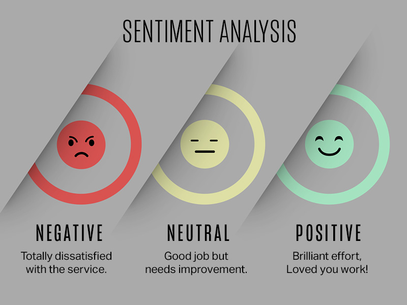
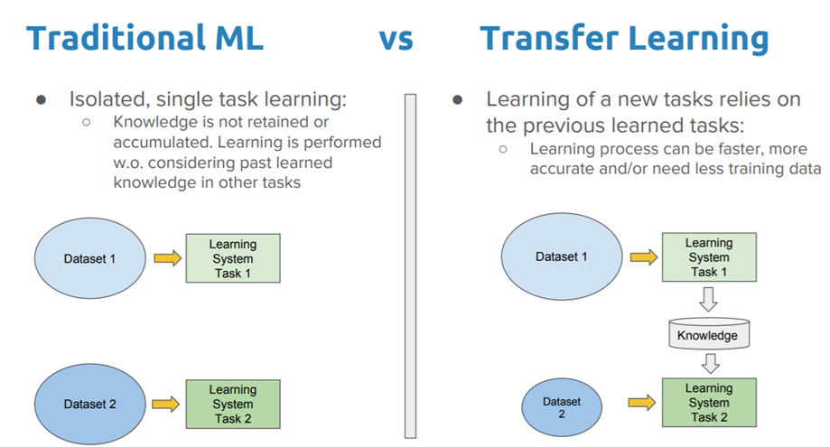

# Sentiment-Analysis-in-Arabic-tweet
You can open the notebook in Kaggle from the icon below.<br>
[](https://www.kaggle.com/code/girgismicheal/sentiment-analysis-in-arabic-tweet/edit/run/103976227)

### **Introduction**

* **Natural Language Processing (NLP):** The discipline of computer science, artificial intelligence and linguistics that is concerned with the creation of computational models that process and understand natural language. These include: making the computer understand the semantic grouping of words (e.g. cat and dog are semantically more similar than cat and spoon), text to speech, language translation and many more

* **Sentiment Analysis:** It is the interpretation and classification of emotions (positive, negative and neutral) within text data using text analysis techniques. Sentiment analysis allows organizations to identify public sentiment towards certain words or topics.




# Table of Contents
1. [Environment Setup](#p1)
    - [Enable the GPU](#p1.1)
    - [Dependencies Installation](#p1.2)
2. [Dataset Importing](#p2)
3. [Dataset Preparation](#p3)
    - [Dataset Cleaning](#p3.1)
    - [Dataset Tokenization](#p3.2)
    - [Label Encoding](#p3.3)
    - [Train Test Spliting](#p3.4)
4. [Build Classical Machine learning Models](#p4)
    - [TF-IDF Embedding](#p4.1)
    - [Train Different Classifiers and Select the Champion Model](#p4.2)
5. [Tramsfer Learning a Pre-trained Models](#p5)
6. [Infer the test data and prepart the subbmion file](#p6)


# <a name="p1">Environment Setup</a>

### <a name="p1.1">Enable the GPU</a>
```Python
import torch
# If there's a GPU available...
if torch.cuda.is_available():    
    # Tell PyTorch to use the GPU.    
    device = torch.device("cuda")
    print('There are %d GPU(s) available.' % torch.cuda.device_count())
    print('We will use the GPU:', torch.cuda.get_device_name(0))
    !nvidia-smi
# If not...
else:
    print('No GPU available, using the CPU instead.')
    device = torch.device("cpu")
```
### <a name="p1.2">Dependencies Installation</a>
```Python
!pip install gdown
!pip install pyarabic
!pip install farasapy
!pip install emoji
!pip install transformers
!git clone https://github.com/aub-mind/arabert.git
```


# <a name="p2">Dataset Importing</a>
The dataset has been scraped from Twitter and then labeled and used in a local competition in EGPYT, It contains 2,746 tweets extracted using the **Twitter API**. The tweets have been annotated (neg = negative, pos = positive, and neu = neutral) and they can be used to detect sentiment.

**Dataset files:**
- train.csv - the training set has 2059 unique entry
- test.csv - the test set has 687 unique entry


**The dataset has 2 fields:**
1. **Tweet**: the text of the tweet
2. **Class**: the polarity of the tweet **(neg = negative, pos = positive, and neu = neutral)**


```Python
import numpy as np
import pandas as pd
import os
for dirname, _, filenames in os.walk('/kaggle/input'):
    for filename in filenames:
        print(os.path.join(dirname, filename))
Data_set = pd.read_csv("/kaggle/input/nlp-arabic-tweets/train.csv")
Data_set
```


# <a name="p3">Dataset Preparation</a>

### <a name="p3.1">Dataset Cleaning</a>
- Remove hyperlinks
- Remove repeated spaces
- Remove English words
- Remove mentions
- Remove emojis
- Remove tashkeel
- Remove special characters
- Remove repeated letters
- Remove stop words
- Apply stemmer
- Normalize letters

**Arabic Stop Word File Importing**

```Python
arabic_stop_words=[]
with open ('../input/arabic-helper-filesnlp/Arabic_stop_words.txt',encoding='utf-8') as f :
    for i in f.readlines() :
        arabic_stop_words.append(i)
        arabic_stop_words[-1]=arabic_stop_words[-1][:-1]
```

**The Cleaning Function**

```Python
import numpy as np
import pandas as pd
import re
import string,emoji, re
import pyarabic.araby as ar
import functools, operator
import logging
logging.basicConfig(level=logging.WARNING)
logger = logging.getLogger(__name__)

def get_emoji_regexp():
    # Sort emoji by length to make sure multi-character emojis are matched first
    emojis = sorted(emoji.EMOJI_DATA, key=len, reverse=True)
    pattern = u'(' + u'|'.join(re.escape(u) for u in emojis) + u')'
    return re.compile(pattern)

def data_cleaning (text):
    text = re.sub(r'^https?:\/\/.*[\r\n]*', '', text, flags=re.MULTILINE)
    text = re.sub(r'^http?:\/\/.*[\r\n]*', '', text, flags=re.MULTILINE)
    text = re.sub(r"http\S+", "", text)
    text = re.sub(r"https\S+", "", text)
    text = re.sub(r'\s+', ' ', text)
    text = re.sub("(\s\d+)","",text)
    text = re.sub(r"$\d+\W+|\b\d+\b|\W+\d+$", "", text)
    text = re.sub("\d+", " ", text)
    text = ar.strip_tashkeel(text)
    text = ar.strip_tatweel(text)
    text = text.replace("#", " ");
    text = text.replace("@", " ");
    text = text.replace("_", " ");
    
    # Remove arabic signs
    text = text[0:2] + ''.join([text[i] for i in range(2, len(text)) if text[i]!=text[i-1] or text[i]!=text[i-2]])
    text =  re.sub(r'([@A-Za-z0-9_ـــــــــــــ]+)|[^\w\s]|#|http\S+', '', text)
    text =  '' if text in arabic_stop_words else text
    from nltk.stem.isri import ISRIStemmer
    text=ISRIStemmer().stem(text)
    
    translator = str.maketrans('', '', string.punctuation)
    text = text.translate(translator)
    em = text
    em_split_emoji = get_emoji_regexp().split(em)
    em_split_whitespace = [substr.split() for substr in em_split_emoji]
    em_split = functools.reduce(operator.concat, em_split_whitespace)
    text = " ".join(em_split)
    text = re.sub(r'(.)\1+', r'\1', text)
    
    text = text.replace("آ", "ا")
    text = text.replace("إ", "ا")
    text = text.replace("أ", "ا")
    text = text.replace("ؤ", "و")
    text = text.replace("ئ", "ي")
    return text
```

**Apply the Cleaning Function**

```Python
Data_set['tweet']=Data_set['tweet'].apply(lambda x: data_cleaning(x))
Data_set
```

### <a name="p3.2">Dataset Tokenization</a>

```Python
from arabert.preprocess import ArabertPreprocessor

model_name = "UBC-NLP/MARBERT"
df = Data_set
arabert_prep = ArabertPreprocessor(model_name=model_name)
df['tweet']=Data_set['tweet'].apply(lambda x: arabert_prep.preprocess(x))
df
```

### <a name="p3.3">Label Encoding</a>

```Python
from sklearn import preprocessing
lable_encoder = preprocessing.LabelEncoder()

encoded_labels=lable_encoder.fit_transform(Data_set["class"])
df['class']=encoded_labels
df
```

### <a name="p3.4">Train Test Splitting</a>

```Python
seed = 42
from sklearn.model_selection import train_test_split
X_train, X_validation, y_train, y_validation=train_test_split(df['tweet'], df['class'], test_size=0.2, random_state=seed)
```


# <a name="p4">Build Classical Machine learning Models</a>


### <a name="p4.1">TF-IDF Embedding</a>

```Python
from sklearn.feature_extraction.text import TfidfVectorizer
def tfidf_ngram(n_gram,X_train,X_val):
    vectorizer = TfidfVectorizer(ngram_range=(n_gram,n_gram))
    x_train_vec = vectorizer.fit_transform(X_train)
    x_test_vec = vectorizer.transform(X_val)
    return x_train_vec,x_test_vec
# Applying tfidf with 1-gram, and 2-gram
tfidf_1g_transformation_train,tfidf_1g_transformation_validation= tfidf_ngram(1,X_train,X_validation)
tfidf_2g_transformation_train,tfidf_2g_transformation_validation= tfidf_ngram(2,X_train,X_validation)
```

### <a name="p4.2">Train Different Classifiers and Select the Champion Model</a>

```Python

%matplotlib ipympl

from sklearn.svm import SVC
from xgboost import XGBClassifier
from sklearn.neighbors import KNeighborsClassifier
from sklearn.linear_model import LogisticRegression
from sklearn.naive_bayes import GaussianNB, MultinomialNB

from sklearn.tree import DecisionTreeClassifier
from sklearn.ensemble import RandomForestClassifier

from sklearn.model_selection import cross_val_score, cross_validate
import matplotlib.pyplot as plt

text_embedding={
    'TF_IDF 1_gram':(tfidf_1g_transformation_train,tfidf_1g_transformation_validation),
    'TF_IDF 2_gram':(tfidf_2g_transformation_train,tfidf_2g_transformation_validation)
}
models=[SVC(), KNeighborsClassifier(), XGBClassifier(), RandomForestClassifier(), DecisionTreeClassifier(), LogisticRegression(), MultinomialNB()]


highest_test_accuracy=0
champion_model_name=''
champion_model=''
champion_embedding=''
results_dict={'Model Name':[],'Embedding type':[],'Training Accuracy':[],'Testing Accuracy':[]}

for model in models:
  for embedding_vector in text_embedding.keys():
    train=text_embedding[embedding_vector][0]
    test=text_embedding[embedding_vector][1]
    model.fit(train, y_train)
    results_dict['Model Name'].append(type(model).__name__)
    results_dict['Embedding type'].append(embedding_vector)
    train_acc=model.score(train, y_train)
    results_dict['Training Accuracy'].append(train_acc)
    test_acc=model.score(test, y_validation)
    results_dict['Testing Accuracy'].append(test_acc)
    if test_acc > highest_test_accuracy:
      highest_test_accuracy=test_acc
      champion_model_name=type(model).__name__
      champion_model=model
      champion_embedding=embedding_vector

results_df=pd.DataFrame(results_dict)
results_df['Model Name']=results_df['Model Name'].apply(lambda x: x[:-10] if 'Classifier' in x else x)
results_df

print('champion_model is ',champion_model_name)
print('champion_embedding is',champion_embedding)
```


# <a name="p5">Transfer Learning a Pre-trained Models</a>
- Used a transformer-based model pre-trained on Arabic language dataset from hugging face called **'MARBERT'** model, chech the link for more infos [hugging face](https://huggingface.co/UBC-NLP/MARBERT).



- Kindly, check this link to read more about the transfer learning [what-is-transfer-learning-and-why-is-it-needed](https://www.educative.io/answers/what-is-transfer-learning-and-why-is-it-needed)


**Model and Tokenizer initialization**

```Python
from transformers import AutoTokenizer, AutoModelForSequenceClassification

tokenizer =AutoTokenizer.from_pretrained('UBC-NLP/MARBERT')
model = AutoModelForSequenceClassification.from_pretrained('UBC-NLP/MARBERT', num_labels=3)
#-----------------------------------
# Tokenize the sentences using bert tokenizer
df["bert_tokens"] = df.tweet.apply(lambda x: tokenizer(x).tokens())
df["bert_tokens_ids"] = df.tweet.apply(lambda x: tokenizer(x).tokens())
df["encoded"] = df.tweet.apply(lambda x: tokenizer.encode_plus(x,return_tensors='pt')['input_ids'])
df
```

**Hyper-parameters**

```Python
# Number of training epochs
epochs = 20
# Select the max sentance lenth
MAX_LEN = 80
# Select a batch size for training. For fine-tuning BERT on a specific task, the authors recommend a batch size of 16 or 32
batch_size =64
```

**Padding**
- Set the maximum sequence length. The longest sequence in our training set is 39, but we'll leave room on the end anyway.
- Use the BERT tokenizer to convert the tokens to their index numbers in the BERT vocabulary
- Apply pad_sequences on our input tokens

```Python
from keras_preprocessing.sequence import pad_sequences

input_ids = [tokenizer.convert_tokens_to_ids(x) for x in df['bert_tokens']]
input_ids = pad_sequences(input_ids, maxlen=MAX_LEN, dtype="long", truncating="post", padding="post")
```


**Attention mask**
- Create the attention mask list
- Create a mask of 1s for each token followed by 0s for padding

```Python
attention_masks = []
for seq in input_ids:
    seq_mask = [float(i>0) for i in seq]
    attention_masks.append(seq_mask)
```

**Build the DataLoader**
- Convert all of our data into torch tensors, the required datatype for our model
- Create an iterator of our data with torch DataLoader. This helps save on memory during training because, unlike a for loop, with an iterator the entire dataset does not need to be loaded into memory

```Python
import torch
from torch.utils.data import TensorDataset, DataLoader
from sklearn.model_selection import train_test_split

# Use train_test_split to split our data into train and validation sets for training
train_inputs, validation_inputs, train_labels, validation_labels = train_test_split(input_ids, encoded_labels,
                                                             random_state=seed, test_size=0.1)
train_masks, validation_masks, _, _ = train_test_split(attention_masks, input_ids,
                                                             random_state=seed, test_size=0.1)

train_inputs = torch.tensor(train_inputs)
validation_inputs = torch.tensor(validation_inputs)
train_labels = torch.tensor(train_labels)
validation_labels = torch.tensor(validation_labels)
train_masks = torch.tensor(train_masks)
validation_masks = torch.tensor(validation_masks)


train_data = TensorDataset(train_inputs, train_masks, train_labels)
train_dataloader = DataLoader(train_data, batch_size=batch_size)

validation_data = TensorDataset(validation_inputs, validation_masks, validation_labels)
validation_dataloader = DataLoader(validation_data, batch_size=batch_size)

```

**Optimizer parameters**

```Python
import torch.optim as optim


param_optimizer = list(model.named_parameters())
no_decay = ['bias', 'gamma', 'beta']
optimizer_grouped_parameters = [{'params': [p for n, p in param_optimizer if not any(nd in n for nd in no_decay)],'weight_decay_rate': 0.01},
                                {'params': [p for n, p in param_optimizer if any(nd in n for nd in no_decay)],'weight_decay_rate': 0.0}]

# This variable contains all of the hyperparemeter information our training loop needs
optimizer = optim.AdamW(optimizer_grouped_parameters,lr=.000005)
```

**Transfer learning on our dataset**

```Python
# Function to calculate the accuracy of our predictions vs labels
def flat_accuracy(preds, labels):
    pred_flat = np.argmax(preds, axis=1).flatten()
    labels_flat = labels.flatten()
    return np.sum(pred_flat == labels_flat) / len(labels_flat)
#---------------------------------------------
from tqdm import trange
import numpy as np

t = []
# Store our loss and accuracy for plotting
train_loss_set = []

if torch.cuda.is_available():
    # Transfer the model to GPU
    model.to("cuda")
# trange is a tqdm wrapper around the normal python range
for _ in trange(epochs, desc="Epoch"):

  # Training
  # Set our model to training mode (as opposed to evaluation mode)
  model.train()
  # Tracking variables
  tr_loss = 0
  nb_tr_examples, nb_tr_steps = 0, 0
  # Train the data for one epoch
  for step, batch in enumerate(train_dataloader):
    # Add batch to GPU
    b_input_ids, b_input_mask, b_labels = batch
    b_labels = b_labels.type(torch.LongTensor)   # casting to long
    # Clear out the gradients (by default they accumulate)
    optimizer.zero_grad()
    # Forward pass
    if torch.cuda.is_available():
        loss = model(b_input_ids.to("cuda"), token_type_ids=None, attention_mask=b_input_mask.to("cuda"), labels=b_labels.to("cuda"))["loss"]
    else:
        loss = model(b_input_ids.to("cpu"), token_type_ids=None, attention_mask=b_input_mask.to("cpu"), labels=b_labels.to("cpu"))["loss"]

    train_loss_set.append(loss.item())
    # Backward pass
    loss.backward()
    # Update parameters and take a step using the computed gradient
    optimizer.step()

    # Update tracking variables
    tr_loss += loss.item()
    nb_tr_examples += b_input_ids.size(0)
    nb_tr_steps += 1

  print("Train loss: {}".format(tr_loss/nb_tr_steps))
  # Validation
  # Put model in evaluation mode to evaluate loss on the validation set
  model.eval()
  # Tracking variables
  eval_loss, eval_accuracy = 0, 0
  nb_eval_steps, nb_eval_examples = 0, 0

  # Evaluate data for one epoch
  for batch in validation_dataloader:
    # Add batch to GPU
    # batch = tuple(t.to(device) for t in batch)
    # Unpack the inputs from our dataloader
    b_input_ids, b_input_mask, b_labels = batch
    b_labels = b_labels.type(torch.LongTensor)   # casting to long
    # Telling the model not to compute or store gradients, saving memory and speeding up validation
    with torch.no_grad():
      # Forward pass, calculate logit predictions
        if torch.cuda.is_available():
            logits = model(b_input_ids.to("cuda"), token_type_ids=None, attention_mask=b_input_mask.to("cuda"))
        else:
            logits = model(b_input_ids.to("cpu"), token_type_ids=None, attention_mask=b_input_mask.to("cpu"))

    # Move logits and labels to CPU
    logits = logits["logits"].detach().cpu().numpy()
    label_ids = b_labels.to('cpu').numpy()
    tmp_eval_accuracy = flat_accuracy(logits, label_ids)
    eval_accuracy += tmp_eval_accuracy
    nb_eval_steps += 1

  print("Validation Accuracy: {}".format(eval_accuracy/nb_eval_steps))
  if (eval_accuracy/nb_eval_steps) > 0.78:
    break
```


	

# <a name="p6">Infer the Test Data and Prepare the Submission File</a>

[//]: # (![image]&#40;https://drive.google.com/uc?export=view&id=1o72wCZZQIF5DcGlzUBK9yYIkiqlwHrT-&#41;)


#### **Testing Dataset Preparation**

```Python
df_submit = pd.read_csv("../input/nlp-arabic-tweets/test.csv")
df_submit["tweet"] = df_submit.tweet.apply(lambda x: data_cleaning(x))
df_submit['tweet']=df_submit['tweet'].apply(lambda x: arabert_prep.preprocess(x))
# Tokenize the sentences using bert tokenizer
df_submit["bert_tokens"] = df_submit.tweet.apply(lambda x: tokenizer(x).tokens())
#---------------------------------
input_ids_submit = [tokenizer.convert_tokens_to_ids(x) for x in df_submit["bert_tokens"]]
input_ids_submit = pad_sequences(input_ids_submit, maxlen=MAX_LEN, dtype="long", truncating="post", padding="post")
attention_masks_submit = []
for seq in input_ids_submit:
    seq_mask = [float(i>0) for i in seq]
    attention_masks_submit.append(seq_mask)
    
inputs_submit = torch.tensor(input_ids_submit)
masks_submit = torch.tensor(attention_masks_submit)
submit_data = TensorDataset(inputs_submit, masks_submit)
submit_dataloader = DataLoader(submit_data, batch_size=batch_size)
model.eval()
if torch.cuda.is_available():
    model.to("cuda")

outputs = []
for input, masks in submit_dataloader:
    torch.cuda.empty_cache() # empty the gpu memory
    if torch.cuda.is_available():
        # Transfer the batch to gpu
        input = input.to('cuda')
        masks = masks.to('cuda')
    # Run inference on the batch
    output = model(input, attention_mask=masks)["logits"]
    # Transfer the output to CPU again and convert to numpy
    output = output.cpu().detach().numpy()
    # Store the output in a list
    outputs.append(output)
# Concatenate all the lists within the list into one list
outputs = [x for y in outputs for x in y]
# Inverse transform the label encoding
pred_flat = np.argmax(outputs, axis=1).flatten()
output_labels = lable_encoder.inverse_transform(pred_flat)
```

#### **Create the Submission File**


```Python
submission = pd.DataFrame({"Id":np.arange(1, len(output_labels)+1), "class":output_labels})
submission.to_csv("submission.csv", index=False)
```